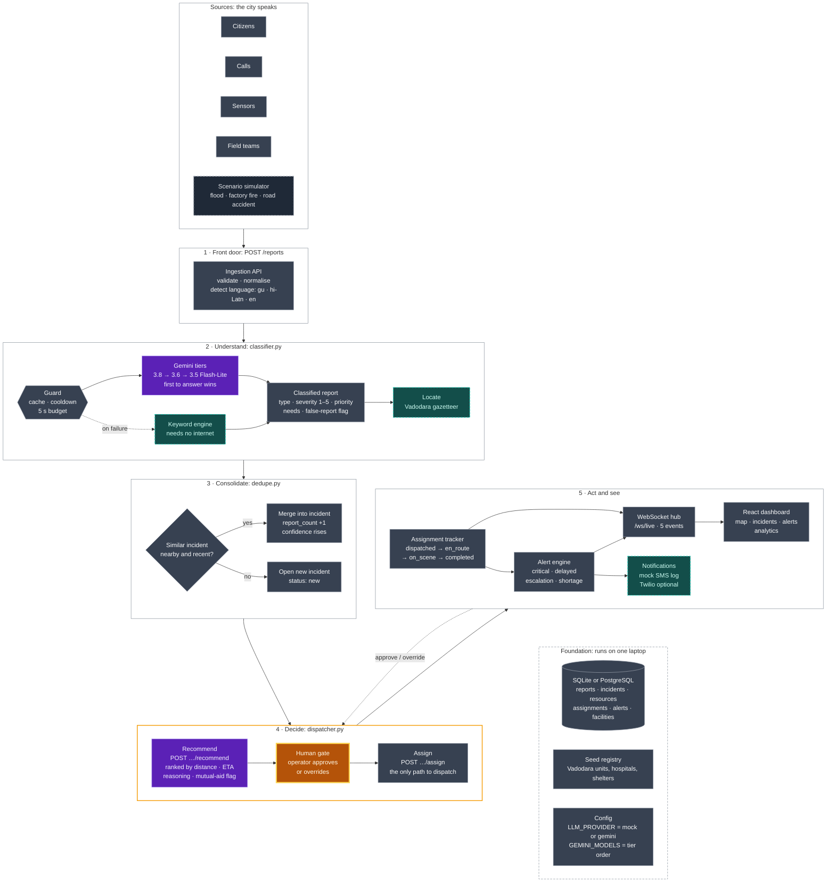
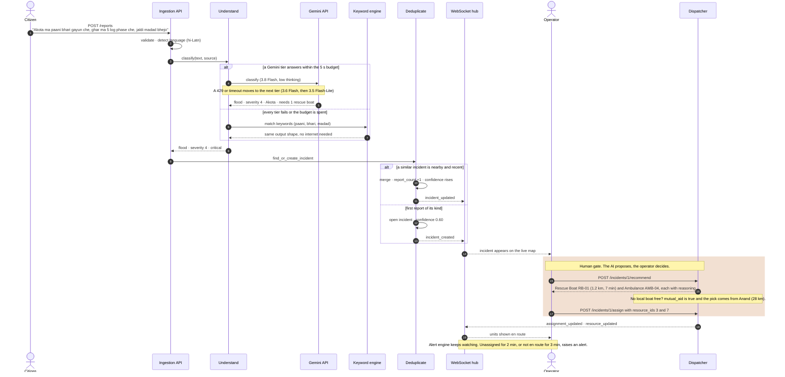

<div align="center">

# 🚨 Sahay AI

**Intelligent Emergency Response & Resource Coordination Platform**

*Sahay (સહાય / सहाय) means "help" in Gujarati and Hindi*

[]()
[](./LICENSE)
[]()
[]()

</div>

---

> **Status:** 🚀 Completed for Bit N Build'26 Gujarat Round (PS-9).

---

## 📋 Problem

During **floods, fires, industrial accidents, and road incidents**, information pours in from many disconnected sources — emergency calls, citizen reports, IoT sensors, field teams, and hospitals. Authorities struggle to:

- See the **full situation** across all sources in real time.
- **Identify duplicates** — ten calls about the same collapsed bridge look like ten separate emergencies.
- **Decide which teams and equipment** to send, especially when resources are limited.
- **Detect delays** — a dispatched ambulance that never moves, an incident with no update for five minutes.
- **Coordinate across agencies** when local resources are exhausted.

The result: slower response times, wasted resources, and preventable harm.

---

## 💡 Solution

Sahay AI is a **command-centre platform** that:

1. **Collects reports** from citizens, calls, sensors, and field teams through a unified ingestion API.
2. **Uses AI to classify** each report by incident type, estimate severity (1–5), and assign priority.
3. **Detects and merges duplicates** — multiple reports about the same event are consolidated into a single incident with a rising confidence score.
4. **Recommends the right teams and equipment** with explainable reasoning, and suggests mutual aid when local units are short.
5. **Shows everything on a live dashboard** — active emergencies, severity, assigned teams, response status, and a real-time map.
6. **Alerts and escalates** — automatic notifications when a critical incident is unassigned, a team is delayed, or an incident has no update.
7. **Keeps a human in the loop** — dispatch is always approved by a human operator.

---

## ✅ Key Features

- [x] **Multi-source incident collection** — citizen reports, emergency calls, sensor data, field team updates
- [x] **AI classification & severity** — automatic incident type, severity (1–5), and priority assignment
- [x] **Duplicate detection & consolidation** — merge related reports into single incidents with confidence scoring
- [x] **Resource recommendation** — AI suggests teams and equipment with reasoning; mutual-aid flag when local resources are short
- [x] **Real-time command dashboard** — active emergencies, severity indicators, assigned teams, response status, live map
- [x] **Alerts & escalation** — critical-unassigned, delayed-response, and no-update alerts with configurable thresholds
- [x] **AI-generated summaries & recommendations** — natural-language incident summaries and dispatch explanations
- [x] **Analytics** — emergency types, response delays, resource shortages, frequently affected areas (hotspot map)
- [x] **Notifications** — Twilio SMS integration and inbound webhooks for external status updates
- [x] **Scenario simulator** — one-click flood simulations for demo and testing
- [x] **Deterministic Emergency Score** — strict math-based operational score combining AI severity, corroboration, and complexity
- [x] **Audit Logs & Timeline** — rigorous tracking of "who did what, when, and why" for every dispatch action

---

## 🌟 What Makes It Different

| Differentiator | Details |
|---|---|
| **Regional language support** | Understands reports in **Gujarati, Hindi, and Hinglish** — not just English. |
| **Confidence scoring** | Confidence rises as independent reports or sensor readings corroborate an incident; likely false reports are flagged. |
| **Explainable dispatch** | Shows *why* each team was chosen, and suggests **mutual aid** when local units are stretched thin. |
| **Human-in-the-loop** | AI recommends — a **human always gives final approval** before dispatch. |
| **Graceful degradation** | If the LLM API is unavailable, a **keyword-based fallback classifier** keeps the system running. |

---

# New Architecture section for `README.md`

**How to install it**

1. In `README.md`, select everything from `## 🏗️ Architecture` down to (but not including) the `---` above `## 🛠️ Tech Stack`.
2. Replace it with the block between the two `BEGIN` / `END` markers below. The markers are HTML comments, so they are invisible on GitHub and safe to leave in.
3. Both diagrams are Mermaid, so GitHub draws them. If the system map looks cramped, paste it into <https://mermaid.live> to preview and adjust.

---

<!-- BEGIN ARCHITECTURE SECTION -->
## 🏗️ Architecture

> **AI proposes. A human decides. The system never goes dark.**

Sahay is a five-stage pipeline. A report enters through one front door, is understood and matched against what is already known, and ends as a recommendation that only an operator can turn into a dispatch. This is the target design; the **Key Features** checklist above tracks what is built.

| Principle | What it means in the design |
|---|---|
| **Many voices, one incident** | Four sources (`citizen`, `call`, `sensor`, `field`) converge into a single incident. Every corroborating report raises its `confidence`. |
| **AI proposes, a human decides** | `POST /incidents/{id}/recommend` changes nothing. Only `POST /incidents/{id}/assign`, with `resource_ids` chosen by the operator, dispatches a unit. |
| **Never dark** | Every AI or network dependency has a local twin. A dead API key or a dropped connection degrades the system; it never stops it. |

### System map



**Legend:** 🟪 AI proposes · 🟧 human decides · ⬛ plain logic · dashed teal border = fallback that works offline · dashed grey border = demo tooling

### One report, end to end

The spec's own example message, followed through every stage, including the moment the LLM fails.



### Where each differentiator lives

Every claim in **What Makes It Different** has a specific home in the architecture, and a matching field in `API_SPEC.md`.

| Differentiator | Where it lives | Proof in the contract |
|---|---|---|
| **Regional language support** | The front door detects the language; the keyword engine carries Gujarati, romanised and English tables. | `language` on every report (`gu`, `hi-Latn`, `en`) |
| **Confidence scoring** | Stage 3 merges each corroborating report, from any source, into the same incident. | `confidence` and `report_count` on every incident |
| **Explainable dispatch** | Stage 4 attaches a reason to every pick and flags mutual aid when local units run out. | `reasoning`, `mutual_aid`, `mutual_aid_reason` |
| **Human-in-the-loop** | Recommend and assign are separate endpoints. There is no code path from a recommendation to a dispatch. | `POST /incidents/{id}/assign` takes operator-chosen `resource_ids` |
| **Graceful degradation** | Guard, keyword engine, local gazetteer, mock SMS log, SQLite. | `GET /health` reports `llm_provider` and `database` |

### Components

Paths are under `backend/app/` unless shown in full.

| Component | Responsibility | Code |
|---|---|---|
| **Ingestion API** | One front door for all four sources. Validates, normalises and detects the language of each report. | `routers/reports.py`, `services/language.py` |
| **Understand** | One structured LLM call per report returns type, severity (1–5), priority, needed resources, a summary and a false-report flag. Place names resolve through the local gazetteer. A guard tries the Gemini tiers in order inside a 5-second budget, skips any tier that just hit its quota, and falls back to keywords if every tier fails. | `services/classifier.py`, `services/keyword_rules.py`, `services/llm/`, `services/geocode.py` |
| **Deduplicate** | Merges same-type reports that are nearby and recent into one incident, raising `confidence` and `report_count`. | `services/dedupe.py` |
| **Dispatcher** | Ranks available units by distance, ETA and capacity; attaches `reasoning`; flags mutual aid; creates assignments only after operator approval. | `services/dispatcher.py`, `routers/incidents.py`, `routers/assignments.py` |
| **Alert engine** | Watches configurable thresholds (for example, a critical incident unassigned for 2 minutes, or a unit not en route within 3) and raises `critical`, `delayed`, `escalation` and `shortage` alerts. | `services/alerts.py`, `routers/alerts.py` |
| **Notifications** | Records alerts sent to personnel as a mock SMS log. Twilio is optional. | `services/notifications.py` |
| **WebSocket hub** | Pushes `incident_created`, `incident_updated`, `assignment_updated`, `alert_created` and `resource_updated` to every open dashboard. | `services/events.py`, `routers/ws.py` |
| **Analytics** | Incidents by type, average response time, resource shortages and hotspots. | `services/analytics.py`, `routers/analytics.py` |
| **Scenario simulator** | Replays flood, factory-fire and road-accident scripts through the same front door as real reports, so the demo exercises the real pipeline. | `services/simulator.py`, `routers/simulate.py`, `data/scenarios/` |
| **React dashboard** | Live map, incident list and detail, dispatch panel with the approval button, resource panel, alert feed and analytics. | `frontend/src/pages/Dashboard.jsx`, `frontend/src/components/` |
| **Data layer** | Reports, incidents, resources, assignments, alerts and facilities. SQLite locally; PostgreSQL when deployed. Seeded with Vadodara units and facilities. | `core/database.py`, `models/`, `backend/scripts/seed.py` |

### Never dark

Each dependency that can fail has a local twin, so the demo survives a bad network.

| Dependency | Preferred path | Local twin | Code |
|---|---|---|---|
| **Language model** | Gemini 3.8 Flash at low thinking; 3.6 Flash and 3.5 Flash-Lite take over on quota errors | A shared 5-second budget, a cache and a per-model cooldown. If every tier fails, the keyword engine returns the same output shape | `services/llm/gemini.py`, `services/classifier.py`, `services/keyword_rules.py` |
| **Place lookup** | The report carries `lat` and `lng` | The Vadodara gazetteer turns a place name into coordinates, with no online geocoder | `services/geocode.py`, `data/vadodara_places.json` |
| **Notifications** | Twilio SMS (optional) | Mock SMS log, so no alert is lost | `services/notifications.py` |
| **Database** | PostgreSQL with PostGIS (optional) | SQLite file, zero setup | `core/database.py` |
| **The whole AI layer** | A live LLM provider | `LLM_PROVIDER=mock` runs the entire pipeline with no API key | `services/llm/` |

### PS-9 coverage

| PS-9 requirement | Sahay component | Contract |
|---|---|---|
| Incident collection from multiple sources | Ingestion API and scenario simulator | `POST /reports`; `source`: `citizen`, `call`, `sensor`, `field` |
| Classification, severity and priority | Understand | `type`, `severity` 1–5, `priority` |
| Duplicate detection | Deduplicate | `report_count`, `confidence` |
| Resource recommendation | Dispatcher | `POST /incidents/{id}/recommend`; units and facilities (see note) |
| Real-time monitoring | WebSocket hub and dashboard | `/ws/live`; incident and assignment `status` |
| Alerts and escalation | Alert engine | `GET /alerts`; `kind`: `critical`, `delayed`, `escalation`, `shortage` |
| AI assistance | Summaries and reasoning | `summary` on incidents; `reasoning` on recommendations |
| Analytics | Analytics | `GET /analytics/summary`: `incidents_by_type`, `avg_response_seconds`, `resource_shortages`, `hotspots` |
| Notifications | Notifications | Mock SMS log; `alert_created` event |

**Note on equipment:** PS-9 lists *teams, vehicles, equipment and facilities* under resource recommendation. Sahay covers units (`ambulance`, `fire_engine`, `police`, `rescue_boat`, `other`) and facilities (`hospital`, `shelter`). The `Resource` object carries `capacity` but no separate equipment list.

**Data:** synthetic Vadodara seed data (units, hospitals, shelters) plus the scenario simulator, which supplies simulated citizen, sensor and field feeds.
<!-- END ARCHITECTURE SECTION -->


## 🛠️ Tech Stack

| Layer | Technology |
|---|---|
| **Backend** | Python 3.11+, FastAPI, SQLAlchemy, WebSockets |
| **Database** | SQLite (dev), PostgreSQL with PostGIS (optional production) |
| **AI** | LLM API (Gemini / Claude) with keyword-based fallback classifier |
| **Frontend** | React, Vite, Tailwind CSS, Leaflet or MapLibre GL |
| **Notifications** | Mock SMS log (Twilio integration optional) |

---

## 📁 Project Structure

```
sahay-ai/
├── backend/                # Python + FastAPI
│   ├── app/
│   │   ├── main.py         # FastAPI app entry point
│   │   ├── models/         # SQLAlchemy models
│   │   ├── routers/        # API route handlers
│   │   ├── services/       # AI pipeline, dispatcher, alerts
│   │   ├── schemas/        # Pydantic request/response schemas
│   │   └── core/           # Config, database, dependencies
│   ├── requirements.txt
│   └── tests/
├── frontend/               # React + Vite
│   ├── src/
│   │   ├── components/     # React components
│   │   ├── pages/          # Dashboard, Analytics, etc.
│   │   ├── hooks/          # Custom React hooks (WebSocket, etc.)
│   │   ├── services/       # API client
│   │   └── utils/          # Helpers
│   ├── package.json
│   └── vite.config.js
├── .env.example            # Environment variable template
├── .gitignore
├── API_SPEC.md             # API contract (source of truth)
├── CLAUDE.md               # AI coding-tool rules
├── AGENTS.md               # Quick-reference AI rules
├── PROGRESS.md             # Development log
├── README.md               # ← You are here
└── LICENSE                 # MIT
```

---

## 🚀 Getting Started

### Prerequisites

- **Python 3.11+** and `pip`
- **Node.js 18+** and `npm`

### 1. Clone the repository

```bash
git clone https://github.com/Ru-2008/sahay-ai.git
cd sahay-ai
cp .env.example .env
# Edit .env with your API keys if needed (mock mode works without keys)
```

### 2. Backend

```bash
cd backend
python -m venv venv

# Windows
venv\Scripts\activate
# macOS / Linux
source venv/bin/activate

pip install -r requirements.txt
uvicorn app.main:app --reload
```

- API docs: [http://localhost:8000/docs](http://localhost:8000/docs)
- Health check: [http://localhost:8000/health](http://localhost:8000/health)

### 3. Frontend

```bash
cd frontend
npm install
npm run dev
```

- Dashboard: [http://localhost:5173](http://localhost:5173)

### 4. Run the Demo Simulator

Once both backend and frontend are running:

```bash
# Trigger a flood simulation (generates ~15 reports)
curl -X POST http://localhost:8000/simulate/flood
```

Or use the Swagger UI at `/docs` to fire the simulation endpoint.

---

## 🎬 Demo Walkthrough (Flood Scenario)

1. **Trigger simulation** → `POST /simulate/flood` generates ~15 incoming reports (citizen, sensor, field team) across Vadodara.
2. **AI processes reports** → classifies each as `flood`, estimates severity, geo-locates, and detects duplicates.
3. **Reports merge** → ~15 reports consolidate into ~3 distinct incidents with rising confidence scores.
4. **Dashboard updates live** → incidents appear on the map, severity indicators light up, resource panel shows availability.
5. **Dispatch recommendation** → operator clicks an incident, sees AI-recommended teams with reasoning, approves dispatch.
6. **Delayed response alert** → one team doesn't go en-route within the threshold → escalation alert fires.
7. **Analytics view** → charts show incident types, response times, resource usage, and hotspot areas.

---

## 👥 Team

Built for **Bit N Build'26 — Gujarat Round** (Problem Statement PS-9).

| Name | Role | GitHub |
|---|---|---|
| *Rudrarajsinh Rana* | Backend (AI & Dashboard ) | https://github.com/Ru-2008 |
| *Akshay Sharma* | Frontend (AI & Dashboard ) | https://github.com/Akshay82480sharma |

---

## 🗺️ Roadmap & Phase Breakdown

The project was built concurrently by two developers (Person A & Person B) across 8 parallel phases:

- **Phase 0 (A0/B0)** — Repository setup, API contract, shared base models, and Geocoding setup.
- **Phase 1 (A1/A2 & B1)** — Thin slice backend (Report ingestion -> AI Classification) and WebSocket real-time wiring.
- **Phase 2 (A3/A4 & B2/B3/B4)** — React Frontend base, Incident Map/List, and Dispatch routing with human approval.
- **Phase 3 (A5 & B5/B6)** — Spatial deduplication engine, Scenario Simulator, automated Alerts, and Analytics.
- **Phase 4 (A6/A7 & B7)** — Real Gemini LLM integration, final polish, joint integration tests, and demo presentation.

---

## 📄 License

This project is licensed under the [MIT License](./LICENSE).

---

<div align="center">
<sub>Built with ❤️ for smarter emergency response</sub>
</div>
