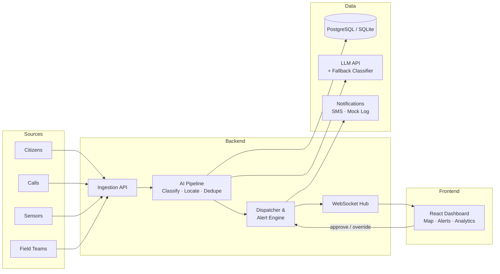

<div align="center">

# 🚨 Sahay AI

**Intelligent Emergency Response & Resource Coordination Platform**

*Sahay (સહાય / सहाय) means "help" in Gujarati and Hindi*

[]()
[](./LICENSE)
[]()
[]()

</div>

---

> **Status:** 🚧 Under active development for Bit N Build'26 Gujarat Round (PS-9).
> Features listed below are planned — checkboxes will be ticked as each is completed.

---

## 📋 Problem

During **floods, fires, industrial accidents, and road incidents**, information pours in from many disconnected sources — emergency calls, citizen reports, IoT sensors, field teams, and hospitals. Authorities struggle to:

- See the **full situation** across all sources in real time.
- **Identify duplicates** — ten calls about the same collapsed bridge look like ten separate emergencies.
- **Decide which teams and equipment** to send, especially when resources are limited.
- **Detect delays** — a dispatched ambulance that never moves, an incident with no update for five minutes.
- **Coordinate across agencies** when local resources are exhausted.

The result: slower response times, wasted resources, and preventable harm.

---

## 💡 Solution

Sahay AI is a **command-centre platform** that:

1. **Collects reports** from citizens, calls, sensors, and field teams through a unified ingestion API.
2. **Uses AI to classify** each report by incident type, estimate severity (1–5), and assign priority.
3. **Detects and merges duplicates** — multiple reports about the same event are consolidated into a single incident with a rising confidence score.
4. **Recommends the right teams and equipment** with explainable reasoning, and suggests mutual aid when local units are short.
5. **Shows everything on a live dashboard** — active emergencies, severity, assigned teams, response status, and a real-time map.
6. **Alerts and escalates** — automatic notifications when a critical incident is unassigned, a team is delayed, or an incident has no update.
7. **Keeps a human in the loop** — dispatch is always approved by a human operator.

---

## ✅ Key Features

<!-- Tick boxes as features are completed -->

- [ ] **Multi-source incident collection** — citizen reports, emergency calls, sensor data, field team updates
- [ ] **AI classification & severity** — automatic incident type, severity (1–5), and priority assignment
- [ ] **Duplicate detection & consolidation** — merge related reports into single incidents with confidence scoring
- [ ] **Resource recommendation** — AI suggests teams and equipment with reasoning; mutual-aid flag when local resources are short
- [ ] **Real-time command dashboard** — active emergencies, severity indicators, assigned teams, response status, live map
- [ ] **Alerts & escalation** — critical-unassigned, delayed-response, and no-update alerts with configurable thresholds
- [ ] **AI-generated summaries & recommendations** — natural-language incident summaries and dispatch explanations
- [ ] **Analytics** — emergency types, response delays, resource shortages, frequently affected areas (hotspot map)
- [ ] **Notifications** — mock SMS log (Twilio integration optional)
- [ ] **Scenario simulator** — one-click flood, factory fire, and road accident simulations for demo and testing

---

## 🌟 What Makes It Different

| Differentiator | Details |
|---|---|
| **Regional language support** | Understands reports in **Gujarati, Hindi, and Hinglish** — not just English. |
| **Confidence scoring** | Confidence rises as independent reports or sensor readings corroborate an incident; likely false reports are flagged. |
| **Explainable dispatch** | Shows *why* each team was chosen, and suggests **mutual aid** when local units are stretched thin. |
| **Human-in-the-loop** | AI recommends — a **human always gives final approval** before dispatch. |
| **Graceful degradation** | If the LLM API is unavailable, a **keyword-based fallback classifier** keeps the system running. |

---

## 🏗️ Architecture



| Component | Responsibility |
|---|---|
| **Ingestion API** | Receives reports from all sources, validates, and normalises input. |
| **AI Pipeline** | Classifies incident type, estimates severity, geo-locates, and deduplicates against existing incidents. |
| **Dispatcher & Alert Engine** | Recommends resources, manages assignments, monitors thresholds, and fires alerts. |
| **WebSocket Hub** | Pushes real-time updates (new incidents, assignment changes, alerts) to connected dashboards. |
| **React Dashboard** | Live map, incident list, resource panel, alert feed, analytics charts. |
| **Database** | Stores incidents, reports, resources, assignments, alerts, and facilities. |
| **LLM API + Fallback** | Powers classification and summaries; keyword fallback ensures zero downtime. |

---

## 🛠️ Tech Stack

| Layer | Technology |
|---|---|
| **Backend** | Python 3.11+, FastAPI, SQLAlchemy, WebSockets |
| **Database** | SQLite (dev), PostgreSQL with PostGIS (optional production) |
| **AI** | LLM API (Gemini / Claude) with keyword-based fallback classifier |
| **Frontend** | React, Vite, Tailwind CSS, Leaflet or MapLibre GL |
| **Notifications** | Mock SMS log (Twilio integration optional) |

---

## 📁 Project Structure

```
sahay-ai/
├── backend/                # Python + FastAPI
│   ├── app/
│   │   ├── main.py         # FastAPI app entry point
│   │   ├── models/         # SQLAlchemy models
│   │   ├── routers/        # API route handlers
│   │   ├── services/       # AI pipeline, dispatcher, alerts
│   │   ├── schemas/        # Pydantic request/response schemas
│   │   └── core/           # Config, database, dependencies
│   ├── requirements.txt
│   └── tests/
├── frontend/               # React + Vite
│   ├── src/
│   │   ├── components/     # React components
│   │   ├── pages/          # Dashboard, Analytics, etc.
│   │   ├── hooks/          # Custom React hooks (WebSocket, etc.)
│   │   ├── services/       # API client
│   │   └── utils/          # Helpers
│   ├── package.json
│   └── vite.config.js
├── .env.example            # Environment variable template
├── .gitignore
├── API_SPEC.md             # API contract (source of truth)
├── CLAUDE.md               # AI coding-tool rules
├── AGENTS.md               # Quick-reference AI rules
├── PROGRESS.md             # Development log
├── README.md               # ← You are here
└── LICENSE                 # MIT
```

---

## 🚀 Getting Started

### Prerequisites

- **Python 3.11+** and `pip`
- **Node.js 18+** and `npm`

### 1. Clone the repository

```bash
git clone https://github.com/Ru-2008/sahay-ai.git
cd sahay-ai
cp .env.example .env
# Edit .env with your API keys if needed (mock mode works without keys)
```

### 2. Backend

```bash
cd backend
python -m venv venv

# Windows
venv\Scripts\activate
# macOS / Linux
source venv/bin/activate

pip install -r requirements.txt
uvicorn app.main:app --reload
```

- API docs: [http://localhost:8000/docs](http://localhost:8000/docs)
- Health check: [http://localhost:8000/health](http://localhost:8000/health)

### 3. Frontend

```bash
cd frontend
npm install
npm run dev
```

- Dashboard: [http://localhost:5173](http://localhost:5173)

### 4. Run the Demo Simulator

Once both backend and frontend are running:

```bash
# Trigger a flood simulation (generates ~15 reports)
curl -X POST http://localhost:8000/simulate/flood
```

Or use the Swagger UI at `/docs` to fire the simulation endpoint.

---

## 🎬 Demo Walkthrough (Flood Scenario)

1. **Trigger simulation** → `POST /simulate/flood` generates ~15 incoming reports (citizen, sensor, field team) across Vadodara.
2. **AI processes reports** → classifies each as `flood`, estimates severity, geo-locates, and detects duplicates.
3. **Reports merge** → ~15 reports consolidate into ~3 distinct incidents with rising confidence scores.
4. **Dashboard updates live** → incidents appear on the map, severity indicators light up, resource panel shows availability.
5. **Dispatch recommendation** → operator clicks an incident, sees AI-recommended teams with reasoning, approves dispatch.
6. **Delayed response alert** → one team doesn't go en-route within the threshold → escalation alert fires.
7. **Analytics view** → charts show incident types, response times, resource usage, and hotspot areas.

---

## 👥 Team

Built for **Bit N Build'26 — Gujarat Round** (Problem Statement PS-9).

| Name | Role | GitHub |
|---|---|---|
| *Rudrarajsinh Rana* | Backend (AI & Dashboard ) | https://github.com/Ru-2008 |
| *Akshay Sharma* | Frontend (AI & Dashboard ) | https://github.com/Akshay82480sharma |

---

## 🗺️ Roadmap

- **Phase 0** — Repository setup, API contract, environment configuration
- **Phase 1** — Thin end-to-end slice (report → classify → display on dashboard)
- **Phase 2** — Duplicate detection, resource recommendation, dispatch with approval
- **Phase 3** — Alerts, escalation, analytics, scenario simulator
- **Phase 4** — Polish, README, demo video, presentation

---

## 📄 License

This project is licensed under the [MIT License](./LICENSE).

---

<div align="center">
<sub>Built with ❤️ for smarter emergency response</sub>
</div>
